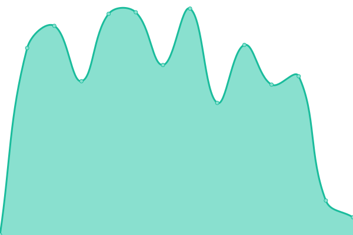
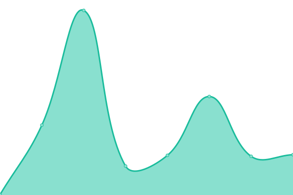

# [📈 Live Status](https://Grandpurs45.github.io/upptime): <!--live status--> **🟩 All systems operational**

This repository contains the open-source uptime monitor and status page for [Grandpurs45](https://Grandpurs45.github.io/upptime), powered by [Upptime](https://github.com/upptime/upptime).

With [Upptime](https://upptime.js.org), you can get your own unlimited and free uptime monitor and status page, powered entirely by a GitHub repository. We use [Issues](https://github.com/Grandpurs45/upptime/issues) as incident reports, [Actions](https://github.com/Grandpurs45/upptime/actions) as uptime monitors, and [Pages](https://Grandpurs45.github.io/upptime) for the status page.

<!--start: status pages-->
<!-- This summary is generated by Upptime (https://github.com/upptime/upptime) -->
<!-- Do not edit this manually, your changes will be overwritten -->
<!-- prettier-ignore -->
| URL | Status | History | Response Time | Uptime |
| --- | ------ | ------- | ------------- | ------ |
|  [Cycleboss45](https://cycleboss45.fr/) | 🟩 Up | [cycleboss45.yml](https://github.com/grandpurs45/upptime/commits/HEAD/history/cycleboss45.yml) | 

 92ms
     
 | 

<a href="https://Grandpurs45.github.io/upptime/history/cycleboss45">100.00%</a>
    

|  [VerifApp - BO](https://verifapp.oudard-lab.fr/index.php?controller=manager_auth&action=login_form) | 🟩 Up | [verif-app-bo.yml](https://github.com/grandpurs45/upptime/commits/HEAD/history/verif-app-bo.yml) | 

 97ms
     
 | 

<a href="https://Grandpurs45.github.io/upptime/history/verif-app-bo">100.00%</a>
    

|  [VerifApp - INGRE - Sortie pharmacie](https://verifapp.oudard-lab.fr/index.php?controller=pharmacy&action=form) | 🟩 Up | [verif-app-ingre-sortie-pharmacie.yml](https://github.com/grandpurs45/upptime/commits/HEAD/history/verif-app-ingre-sortie-pharmacie.yml) | 

 87ms
     
 | 

<a href="https://Grandpurs45.github.io/upptime/history/verif-app-ingre-sortie-pharmacie">100.00%</a>
    

<!--end: status pages-->

[**Visit our status website →**](https://Grandpurs45.github.io/upptime)

## 📄 License

- Powered by: [Upptime](https://github.com/upptime/upptime)
- Code: [MIT](./LICENSE) © [Anand Chowdhary](https://anandchowdhary.com), supported by [Pabio](https://pabio.com)
- Data in the `./history` directory: [Open Database License](https://opendatacommons.org/licenses/odbl/1-0/)
